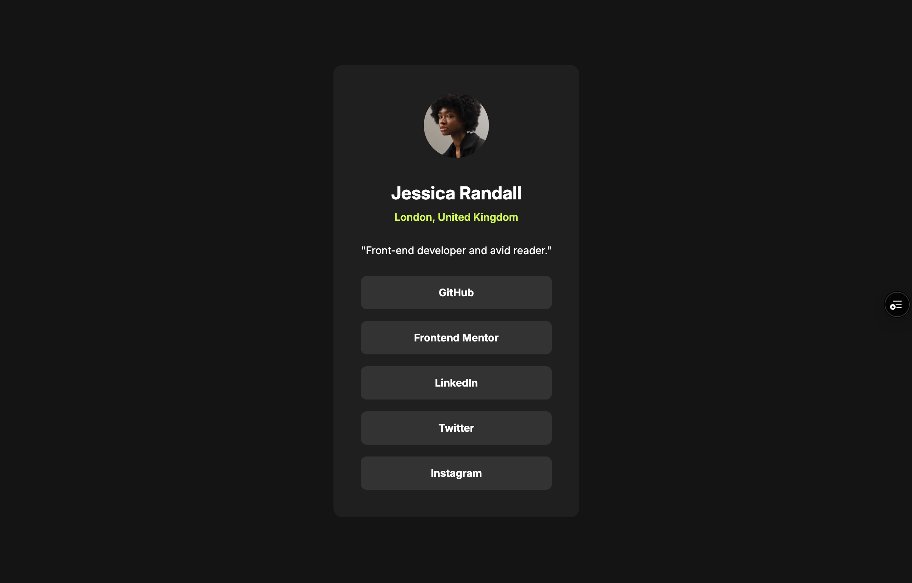

# Frontend Mentor - Social links profile solution

This is a solution to the [Social links profile challenge on Frontend Mentor](https://www.frontendmentor.io/challenges/social-links-profile-UG32l9m6dQ). Frontend Mentor challenges help you improve your coding skills by building realistic projects.

## Table of contents

- [Overview](#overview)
  - [The challenge](#the-challenge)
  - [Screenshot](#screenshot)
  - [Links](#links)
- [My process](#my-process)
  - [Built with](#built-with)
  - [What I learned](#what-i-learned)
- [Author](#author)

## Overview

This is a basic Social Profile challenge. My main focus was on creating fluid padding with the clamp function, and ensuring that users could navigate the links using only the keyboard.

### The challenge

Users should be able to:

- See hover and focus states for all interactive elements on the page

### Screenshot

### Links

- Solution URL: https://github.com/smartinuk88/social-links-profile
- Live Site URL: https://social-links-profile-five-pink.vercel.app/

## My process

I started from the Figma files, setting up CSS custom properties from the design system. I then set up my basic CSS environment, removing default browser spacing and began with the HTML. I then worked from the top of the HTML down, adding the appropriate styling. Finally, I added fluid spacing where appropriate to make the design responsive.

### Built with

- Semantic HTML5 markup
- CSS custom properties
- Flexbox
- Clamp function
- Mobile-first workflow

### What I learned

I am honing my workflow efficiency and ability in the fundamentals, ensuring that these core skills become second nature.

I am also becoming much more confident with clamp and calc functions to create fluid, responsive designs without unnecessary media queries.

## Author

- Website - [Scott Martin](https://www.scottmartinwebdevelopment.com)
- Frontend Mentor - [@smartinuk88](https://www.frontendmentor.io/profile/smartinuk88)
